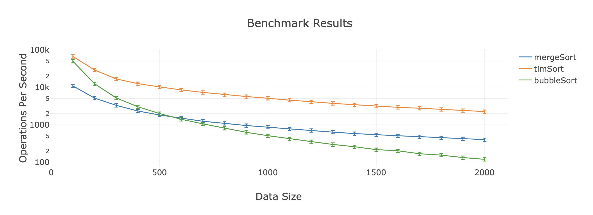

# BenchMe README for Visual Studio Code

A micro-benchmarking tool for developers with Live Programming aspects. Only supports JavaScript for now.

## **Disclaimer** this is still in Development!

## What the extension seeks to achieve

BenchIt aims to bring benchmarking into VSCode, making it easy for developers to micro-benchmark their JavaScript functions. 


**GIF HERE**
More Info Below:

## Pre-release use

If you want to try this out now, before its published as a VSCode extension, you will need the following:

- Node
- NPM
- VSCode

Clone this repository somewhere and open it with VSCode.

- Run `npm install` that will install all the dependancies
- Run `npm run watch` which will compile all the Svelte pages
- Press `F5` on the keyboard to run the extension inside VSCode or click `Run` and `Start Debugging`

You will now be able to use the extension in its current state, whilst debugging the extension.


### Bugs

As BenchIt is still pre-release, if you find any bugs or issues with it please feel free to open an issue on this repo.

The extension itself is a bit inefficient at the moment, but that will be polished later after all the functionality is up to speed.

### v0.5 Functionality
- Bencharmking isolated functions with visualised results
- Example Based declerations for a functions parameters
- Live function tracking (Any code changes update automatically)
- Recursive support
- Supports functions inside functions
- Benchmarking takes place on a different thread (Minimal performance impact)
- `Simple Benchmarks` do not officially support parameters. The functionality is there **however** does not produce reliable or fair benchmarks.
- `Dynamic Benchmarks` only support **one** parameter, which has to be of type **Array**. You can randomley generate an array instead of writing it out as an example.
- The `Random Generation` only generates an array of type `Number`

### v0.5 Limitations
- Limited Example Based Programming
- Limited Error Handling
- Limited ES5 Support
- Does not support arrow functions
- Benchmarking not tested with promises/async functions yet

[Check whats left to complete before v1.0 here](https://github.com/RockiRider/BenchIt/projects/1)

## How to use it

- Open a `.js` file in VSCode
- Use the `addCase` VSCode command
- Enter in any functions name that is declared inside the currently open `.js` file.
- If the function takes in any parameters/or if you want to make this a dynamic benchmark you will have to declare some **examples** as exhibited [here]()
- Once the function is registered, its now being tracked and saved by the extension. You can remove the function from the dock whenever you wish via the sidebar.
- Click `Open Browser` and you can now benchmark all your tracked `Simple` or `Dynamic` functions. 


## Syntax for Example Based Programming

``` javascript
/** mergeSort Example
 * @param {Array} arr
 * @type == Dynamic
 * @example arr == [1, 30, 4, 21, 100000,600]
 */
function mergeSort(arr){
    //code is here
};
```

**You can also generate an Array of numbers**
 \
 The code below generates an array with 2000 random Integers ranging from 0 - 10000

``` javascript
/** mergeSort Example
 * @param {Array} arr
 * @type == Dynamic
 * @example arr == "RandomInt 2000"
 */
function mergeSort(arr){
    //code is here
}
```
## Development Instructions
1. Install npm dependacies 
2. Run `npm run watch` to compile
3. Run the codebase with VSCode (F5), this should open a new VSCode instance
4. Open a JS File with that instance and start benchmarking!

### Getting Started Script
**Why not try and benchmark sorting algorithms in JS?**
Please check the repo's issues if this does not work correctly!
``` javascript
/** mergeSort Example
*@param {Array} arr
*@type == Dynamic
*@example arr == "RandomInt 200"
*/
function mergeSort(arr){
    const half = arr.length / 2
    if(arr.length < 2){
      return arr 
    }
    const left = arr.splice(0, half)
    function merge(left, right) {
        let arr = []
        while (left.length && right.length) {
             
            if (left[0] < right[0]) {
                arr.push(left.shift())  
            } else {
                arr.push(right.shift()) 
            }
        }
        return [ ...arr, ...left, ...right ]
    }
    return merge(mergeSort(left),mergeSort(arr))
}
/** timSort Example
* @param {Array} arr
* @type == Dynamic
* @example arr == "RandomInt 300"
*/
function timSort(arr){
    let sorted = arr.sort((a, b) => a - b));
    return sorted;
}
/**  bubbleSort Example
* @param {Array} arr
* @type == Dynamic
* @example arr == "RandomInt 500"
*/
function bubbleSort(arr){
    let len = arr.length;
    let swapped;
    do {
        swapped = false;
        for (let i = 0; i < len; i++) {
            if (arr[i] > arr[i + 1]) {
                let tmp = arr[i];
                arr[i] = arr[i + 1];
                arr[i + 1] = tmp;
                swapped = true;
            }
        }
    } while (swapped);
    return arr;
}
```

**The output to expect should be something like this**


**The key functionality with `Dynamic benchmarking` is witnessing the speed of algorithms change as the data size increases**


### Extra information
The benchmarking functionality is built ontop of Benchmark.js (formally utilised in JSPerf).

It's all on you to ensure that you micro-benchmark correctly.

However... we do try to help you along the way. 

For Instance when benchmarking the `Dynamic` type, the largest array declared (via the example based inputs) will be used for all the `Dynamic functions` within that benchmarking instance. Ensuring a constant workload through-out your benchmarks!

We combat dead code elimination on the back-end, thus heavily encourage benchmarking with functions that actually return something!
